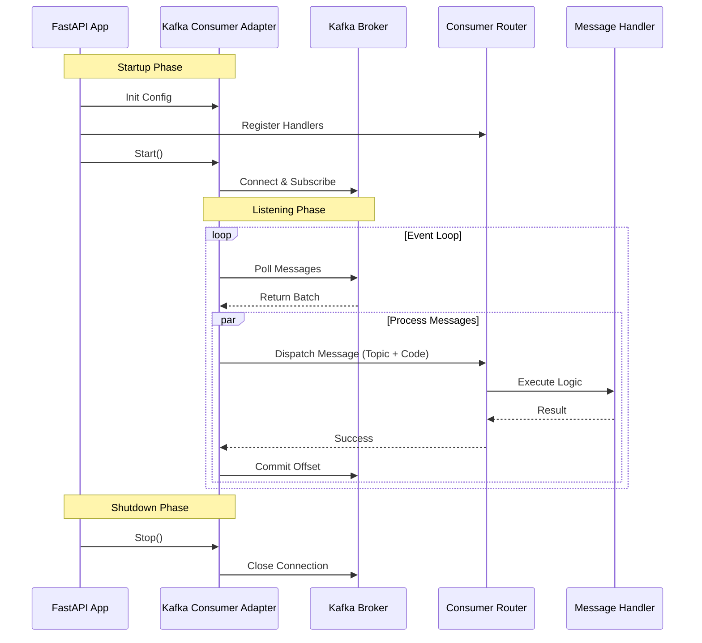

# Consumer

The Consumer component in Kafkify allows you to subscribe to Kafka topics and process incoming messages. It supports routing messages to specific handler functions based on the topic and an optional "code" within the message payload.

## Workflow

The following sequence diagram illustrates the lifecycle of the Consumer and how messages are processed.



## Usage

To use the consumer:

1.  **Configure**: Create an instance of `KafkaConsumerConfig`.
2.  **Instantiate**: Create an instance of `KafkaBaseConsumerAdapter` with the config.
3.  **Register Handlers**: Use the `@consumer.get` decorator or a `ConsumerRouter` to register functions to handle messages.
4.  **Start**: Call `await consumer.start()` to connect to Kafka.
5.  **Listen**: Call `await consumer.listen()` to start the consumption loop (usually in a background task).
6.  **Stop**: Call `await consumer.stop()` to gracefully shutdown.

See the [Consumer Example](examples/consumer.md) for a complete walkthrough.

## Message Structure for Routing

To use the `codes` filtering feature in your handlers, your Kafka messages must be deserialized into a dictionary and contain a `code` field.

The Consumer Adapter inspects the message value:

  1.  Checks if it is a dictionary.
  2.  Extracts the value of the `code` key.
  3.  Matches it against registered handlers.

### Example Payload

For a handler registered with `@router.get({"topic": "my-topic", "codes": ["USER_CREATED"]})`, the message payload should look like this:

```json
{
  "code": "USER_CREATED",
  "data": {
    "user_id": 123,
    "email": "user@example.com"
  },
  "timestamp": "2023-10-27T10:00:00Z"
}
```

If the `code` field is missing or the value is not a dictionary, the message will be routed to the default handler for that topic (if one exists). 

!!! warning "Be careful"

    If no handler is found, the event will be skipped and committed automatically.

# Components

## Configuration
The `KafkaConsumerConfig` Pydantic model defines the available configuration options for the consumer.

::: src.consumers.infrastructure.config.consumer_settings.KafkaConsumerConfig

## Base Consumer
The `BaseConsumer` defines the interface for all consumer implementations.

::: src.consumers.domain.ports.base_consumer.BaseConsumer

## Kafka Adapter
The `KafkaBaseConsumerAdapter` is the concrete implementation using `aiokafka`. It handles the low-level details of connecting to Kafka, polling for messages, committing offsets, and handling rebalances.

::: src.consumers.infrastructure.adapters.base_consumer_adapter.KafkaBaseConsumerAdapter

## Router
The `ConsumerRouter` allows you to organize your message handlers in a modular way, similar to `APIRouter` in FastAPI.

::: src.consumers.router.ConsumerRouter

## Rebalance Handler
The `RebalanceHandler` listens for partition assignment changes during a consumer group rebalance. It ensures that message processing is paused/resumed correctly during these events to avoid inconsistencies.

::: src.consumers.infrastructure.adapters.base_rebalance_listener.RebalanceHandler
