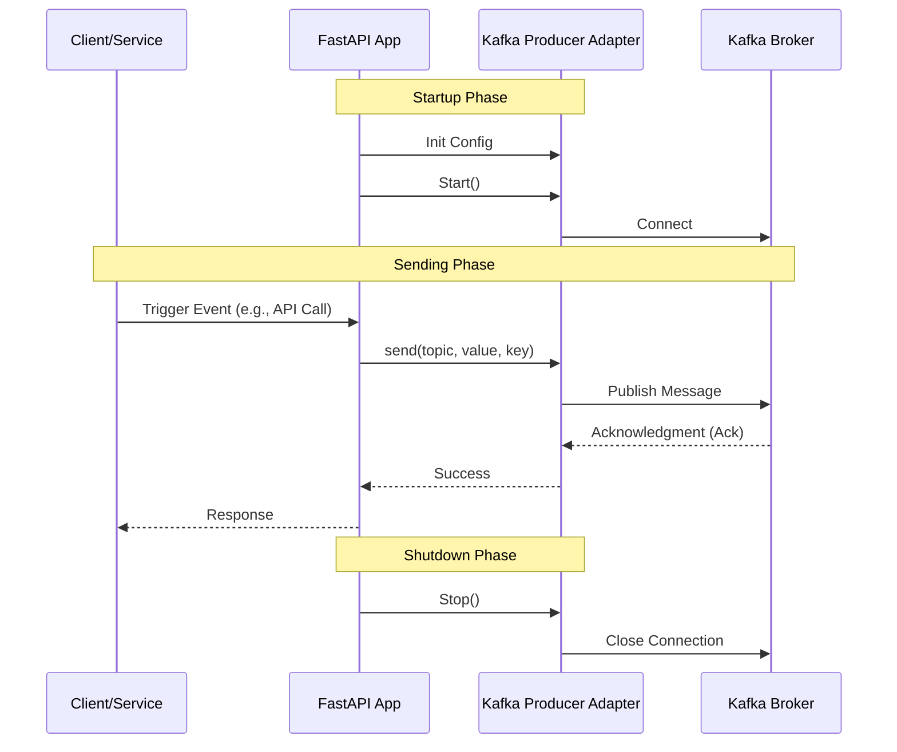

# Producer

The Producer component in Kafkify allows you to send messages to Kafka topics.

## Workflow

The following sequence diagram illustrates how the Producer is initialized and how messages are sent.

## Usage

To use the producer:

1.  **Configure**: Create an instance of `KafkaProducerConfig`.
2.  **Instantiate**: Create an instance of `KafkaBaseProducerAdapter` with the config.
3.  **Start**: Call `await producer.start()` to connect to Kafka.
4.  **Send**: Call `await producer.send(topic, value, key)` to publish messages.
5.  **Stop**: Call `await producer.stop()` to close the connection.

See the [Producer Example](examples/producer.md) for a complete walkthrough.

# Components

## Configuration
The `KafkaProducerConfig` Pydantic model defines the available configuration options for the producer.

::: src.producers.infrastructure.config.producer_settings.KafkaProducerConfig

## Base Producer
The `BaseProducer` defines the interface for all producer implementations.

::: src.producers.domain.ports.base_producer.BaseProducer

## Kafka Adapter
The `KafkaBaseProducerAdapter` is the concrete implementation using `aiokafka`.

::: src.producers.infrastructure.adapters.base_producer_adapter.KafkaBaseProducerAdapter
